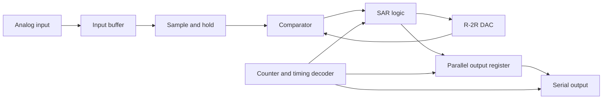
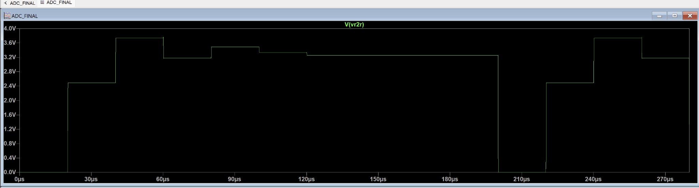
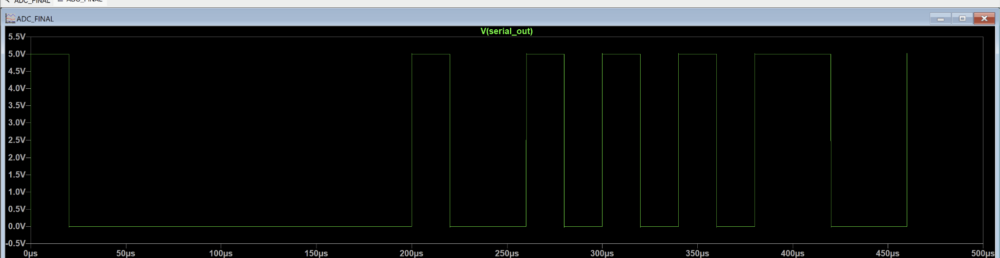

# 8-Bit SAR ADC in LTspice

This project implements and simulates an **8-bit successive-approximation register (SAR) analog-to-digital converter** in LTspice.

The circuit samples an analog input, determines its 8-bit digital code one bit at a time, stores the result in a parallel output register, and transmits it through a serial output.

## System architecture



## Main blocks

- Input buffer using a TL07x operational amplifier
- CD4066 sample-and-hold switch and holding capacitor
- LM311 comparator with an open-collector pull-up resistor
- 8-bit R-2R digital-to-analog converter
- SAR decision logic built from 74HCT gates and D flip-flops
- Counter and decoder generating the conversion phases
- 74HCT374 parallel output register
- Multiplexer-based serial output circuit

## How the conversion works

The timing circuit activates the SAR stages sequentially.

1. The most significant bit is temporarily set to `1`.
2. The R-2R DAC converts the trial code into an analog voltage.
3. The comparator checks whether the trial voltage is above or below the sampled input.
4. The tested bit is either kept or cleared.
5. The same process continues down to the least significant bit.
6. At the end of the conversion, the result is transferred to the output register.

## Example result

For an analog input of approximately `3.33 V` and a `5 V` DAC reference:

```text
ADC code = 10101010₂ = 170₁₀
```

The ideal voltage represented by this code is:

```text
5 × 170 / 256 = 3.3203125 V
```


## Successive-approximation waveform

The DAC output changes after each bit test and progressively approaches the sampled input.



## Serial output

The ADC result is transmitted **LSB first**, with a start bit at `0` and a stop bit at `1`.



## Running the project

1. Download or clone the repository.
2. Keep the folder structure unchanged.
3. Open `ADC_FINAL.asc` in LTspice.
4. Run the transient simulation.
5. Plot V(serial_out) to view the conversion result.
6. Change the input voltage source, initially set to 3.33 V, to test different ADC conversions.

The schematic currently uses:

```spice
.tran 0 500u 0 500n
.options reltol=0.01
```

## Repository structure

```text
8-bit-sar-adc-ltspice/
├── ADC_FINAL.asc
├── 74hct.lib
├── CD4000_v.lib
├── CD4066.sub
├── LM311.301
├── TL071.mod
├── TL07x.sub
├── required LTspice symbols
├── 74HCT/
│   └── additional referenced 74HCT symbols
└── images/
    ├── successive-approximation.png
    └── serial-output.png
```

## Notes

Generated LTspice files such as `.raw`, `.log`, `.net`, and `.op.raw` are intentionally excluded because they are large and can be recreated by running the simulation.

The external SPICE models and custom LTspice symbols are included only to make the simulation reproducible. See `THIRD_PARTY_MODELS.md`.
